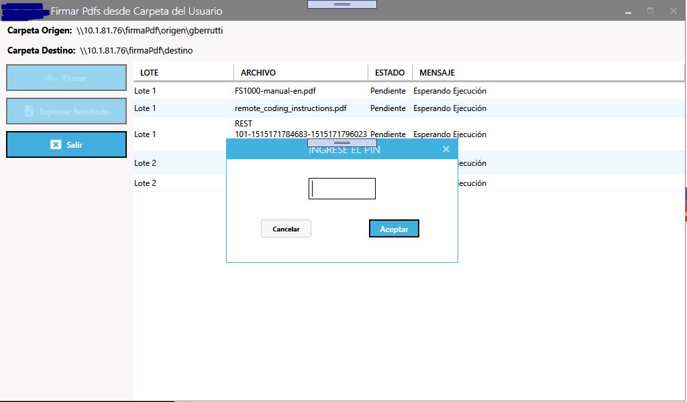
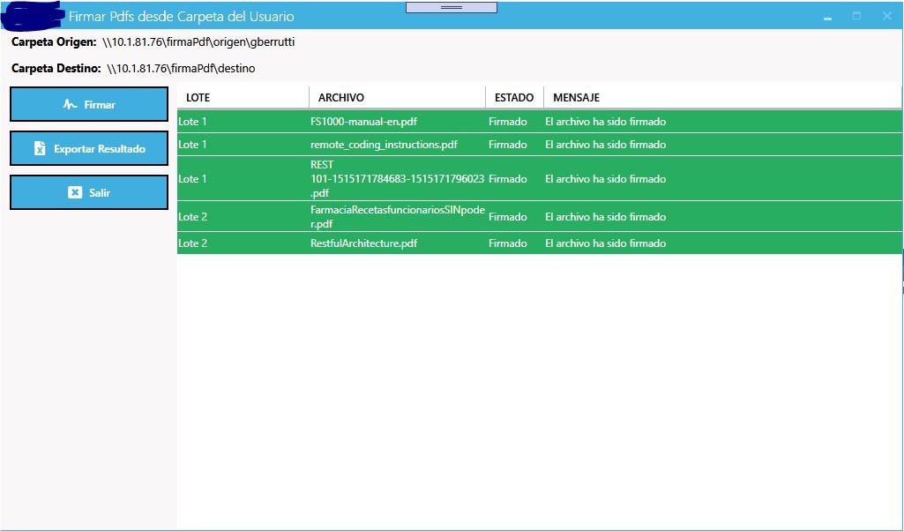

# FirmaPdfSmartCard
Permite la firma de Pdfs utilizando la cédula uruguaya. Este es el caso particular, 
pero podría adaptarse fácilmente a cualquier dispositivo que soporte el api PKCS #11: módulos HSM (hardware security module)
u otras Smart Cards.

### Licencia
Se distribuye con licencia AGPL, debido a que parte de la aplicación utiliza 
itext que obliga a los trabajos derivados a usar dicha licencia.

## Proyectos Open Source Utilizados
- Newtonsoft.Json: https://github.com/JamesNK/Newtonsoft.Json
- NPOI: https://github.com/tonyqus/npoi
- Serilog: https://github.com/serilog/serilog
- Websocket.Client: https://github.com/Marfusios/websocket-client
- Pkcs11Interop: https://github.com/Pkcs11Interop/Pkcs11Interop
- Portable.BouncyCastle: https://www.bouncycastle.org/csharp/
- itext7 Community: https://github.com/itext/itext7-dotnet
- MahApps.Metro: https://github.com/MahApps/MahApps.Metro
- MahApps.Metro.IconPacks.FontAwesome: https://github.com/MahApps/MahApps.Metro.IconPacks

## Solución
La solución consta de dos proyectos:
- **Signer**: Biblioteca que expone la interfaz IFirmaDocumentos, que retorna las implementaciones
  que permiten firmar distintos tipos de documentos: en principio sólo PDF. La otra clase importante es FirmaDocumentosFactory
  que crea las instancias de IFirmaDocumentos. Al momento existe una sóla implementación, pero podría extenderse.
- **FirmaPdfWpf**: Aplicación de escritorio que utiliza la biblioteca signer y que se adapta a los requerimientos
  particulares del usuario para el que se desarrolló la solución.

### Signer
> .Net Standard 2.0

Originalmente para la firma de PDFs se iba a utilizar únicamente un producto disponible en todos los pcs clientes llamado IsCertHub
que es utilizado para firmar documentos desde un navegador (utilizando un plugin). Expone su funcionalidad a través de un websocket que recibe un archivo
codificado en base64 (y otros datos en un parámetro "json") y cuando está listo lo retorna firmado. Esta arquitectura hace posible que pueda
ser llamado desde cualquier tipo de aplicación, incluyendo una aplicación de escritorio. 

En el caso particular de firmar utilizando la cédula (smart card), el servicio se encarga de solicitar el pin al usuario y mantiene la session
con el card reader por un tiempo, lo que hace posible firmar muchos documentos sin volver a solicitarlo. En este esquema, en principio
se definió una interfaz IPdfSigner (luego eliminada) que expone métodos para firmar un archivo. 

El servicio tiene como limitante que sólo se puede enviar al websocket un archivo a la vez, lo que hace que la aplicación no pueda seguir
procesando y deba bloquearse a la espera de la respuesta antes de continuar con el siguiente archivo. Al no ser sincrónico, los usuarios de la biblioteca
tienen que tener una forma sencilla de ser notificado cuando el archivo esté listo, para eso la interfaz IPdfSigner expone el evento *SignedFileEvent*.

Luego de un poco de investigación, se encontró que no era tan dificil acceder al token utilizando directamente el driver del Card Reader utilizado,
y por lo tanto se decidió hacer una nueva implementación. En este caso, la biblioteca debe exigir que el cliente suministre el pin y por lo tanto se debe
notificar si la implementación lo requiere o no. Debido a este requirimiento, se eliminó la interfaz y se definió una clase abstracta
con la misma especificación más una propiedad de sólo lectura *RequiresPin* que le indica al cliente si la implementación que se va 
a utilizar requiere que se provea el pin (propiedad *Pin* de la misma clase) o no. La propedad *RequiresPin* en su implementación por defecto
retorna false.

Si bien el Card Reader utilizado es del "tipo" Feitian 301, y se probó utilizando la biblioteca específica, se utiliza a través de
la biblioteca **Pkcs11Interop** que soporta una gran variedad de lectores.

Tanto la implementación (IsaSigner o Pkcs11Interop) como la biblioteca del Card Reader se pueden configurar en el archivo de configuración
de la aplicación cliente.

#### Ejemplo de uso
```csharp
 using (var pdfSigner = FirmaDocumentosFactory.GetInstance().getPdfSigner())
{
	var run = true;
	if (pdfSigner.RequiresPin)
	{
		//Si el pin es requerido se debe solicitar. 
		//Asumir que AskForPin retorna un objeto con un atributo que indica si se ingresó o no y en caso afirmativo, otro atributo con el pin.
		var result = AskForPin();
		if (result.dialogResultOk)
		{
			if (String.IsNullOrWhiteSpace(result.pin))
			{
				//mostrar mensaje, escribir en log, etc si es necesario
				run = false;
			}
			else
			{
				//se le asigna al signer el pin ingresado por le usuario
				pdfSigner.Pin = result.pin;
			}

		}
		else
			//si no se ingresa, no se ejecuta
			run = false;
	}
	//Si las condiciones son correctas se inicia el proceso de firma.
	if (run){
		pdfSigner.SignedFileEvent += PdfSigner_SignedFileEvent;
		//ArchivosParaFirmar es una lista de archivos que se quieren firmar.
		foreach (var a in ArchivosParaFirmar)
		{
			pdfSigner.SignPdf(a.File);
		}
	}
}
```
Un ejemplo de manejo del evento (PdfSigner_SignedFileEvent) sería el siguiente:
```csharp
 private void PdfSigner_SignedFileEvent(object sender, SignedFileEventArgs e)
{
	//Lote es un concepto particular de la aplicación
	if (e.HasError)
	{
		logger.Error("Ha ocurrido un error firmando el archivo {archivo} del lote {lote} con el siguiente mensaje: {mensaje}", e.File.Name, a.Lote, e.Message);
	}
	else
	{
		try
		{
			File.WriteAllBytes(System.IO.Path.Combine(carpetaDestino, e.File.Name), e.SignedContent);
		}
		catch (Exception es)
		{
			logger.Error("No se pudo guardar el archivo {directorio} .", a.File.FullName);

			return;
		}
		logger.Information("El archivo {archivo} del lote {lote} ha sido firmado.", a.File.Name, a.Lote);
	}

}

```
 ### FirmaPdfWpf
> Framework 4.7.2 o superior

Por ser la primera vez usando Wpf, seguramente se detectan algunos defectos en el uso del patrón MVVM y de la tecnología en gral.
Aclarado esto, pasemos a los requerimientos básicos de la aplicación:

- Dado un directorio base de origen de los documentos, se deben buscar archivos de tipo PDF en un subdirectorio cuyo nombre coincide
 con el del usuario que inció sesión en la máquina.
- Este directorio contendrá subdirectorios donde se encuentran efectivamente los archivos. El directorio padre del archivo es lo que se 
  denomina "Lote".
- El siguiente paso es firmar cada uno de los PDFs recuperados del origen y guardarlos en el direcorio destino. Es un directorio común
  para todos los usuarios.
- Si el archivo firmado se pudo guardar correctamente, se borra el original, sino se deja para ser procesado en otra oportunidad.
- Si luego de borrar el archivo origen, la carpeta que lo contiene queda vacía, también se borra.

#### Solicitud de Pin
Si la implementación configurada requiere el pin para la firma, una vez que se presiona el botón firmar,
la aplicación despliega la siguiente pantalla:



#### Resultado de la ejecución
Si al presionar el botón Firmar existen archivos que cumplen las condiciones para la firma, una vez que se procesan
todos, la pantalla queda de la siguiente manera.



**Descripción de los elementos de la pantalla**

* *Carpeta origen:*  El directorio base + nombre del usuario
* *Carpeta destino:* Donde se guardarán los archivos firmados.
* *Grilla*: Según el color de la fila
  * Verde: El archivo se firmó y procesó correctamente.
  * Rojo: Ocurrió un error al procesar el archivo. Queda disponible para reprocesar.
  * Amarillo: El archivo se firmó y guardó correctamente, pero ocurrio algún otro error, 
    por ejemplo, no se pudo borrar el archivo origen o el directorio vació que lo contnenía. 

### Configuración
A continuación se muestra la porción del archivo de configuración de la aplicación que permite configurarla,
que además incluye las opciones de configuración de la biblioteca Signer.

```xml
 <appSettings>
    <add key="IsaHubHostUri" value="wss://127.0.0.1" />
    <add key="IsaHubPorts" value="4321,4322,4323" />

    <add key="PkcsInteropSigner.dllPath" value="C:\Program Files\Gemalto\Classic Client\BIN\gclib.dll" />

    <add key="PdfSigner.Impl" value="PkcsInterop" /> <!-- Valores válidos: IsCert, PkcsInterop-->
  </appSettings>
    <applicationSettings>
        <FirmaPdfWpf.Properties.Settings>
            <setting name="CarpetaOrigen" serializeAs="String">
                <value>\\gustavo\firmaPdf\origen</value>
            </setting>
            <setting name="CarpetaDestino" serializeAs="String">
                <value>\\gustavo\firmaPdf\destino</value>
            </setting>
        </FirmaPdfWpf.Properties.Settings>
    </applicationSettings>
```

* IsCertHub
  *  **IsaHubHostUri:** la url en la que escucha el websocket
  *  **IsaHubPorts:** Lista de puertos en las que puede estar levantado el websocket. La implementación chequea la disponibilidad del servicio en un determinado puerto siguiendo en orden ingresado.
* PkcsInterop
  * **PkcsInteropSigner.dllPath:** el camino a la biblioteca del Card Reader específico que se utilizará. 
  * **PdfSigner.Impl** La implementación que se usará para la firma. Valores válidos al momento de la escritura: IsCert y PkcsInterop.
* FirmaPdfWpf
  * **CarpetaOrigen:** carpeta base para la lectura de archivos (sin el nombre de usuario).
  * **CarpetaDestino:** donde se guardarán los archivos firmados (común a todos los usuarios).
  